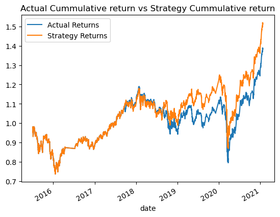
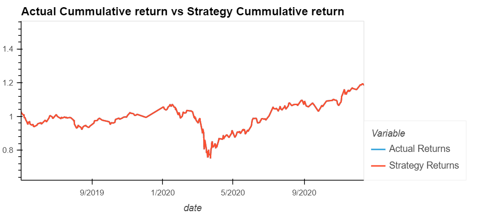
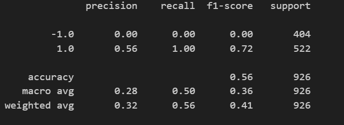
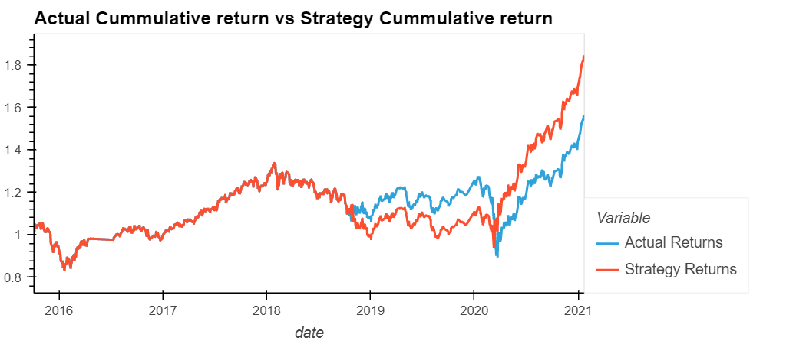
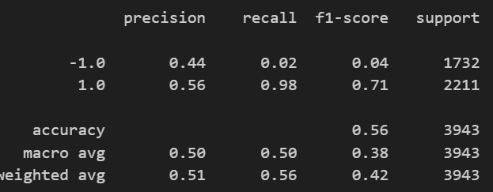
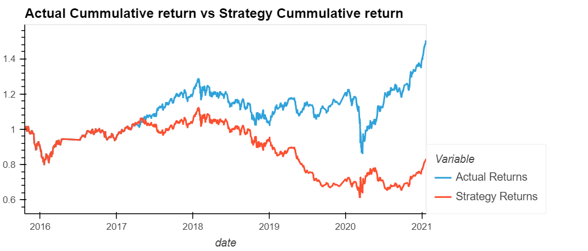
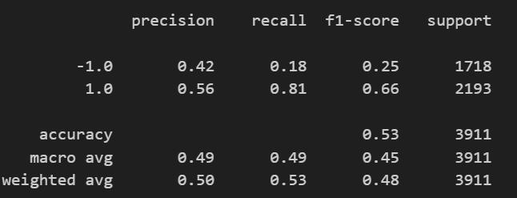

# Challenge XIV | Fintech 
---
This project is the fourtheen challenge in the Columbia Fintech Bootcamp.

This challenge deals with Trading algorithms, trading algorithms backtesting and machine learning with trading algorithms


The source data includes: 

* [OHLCV - Emerging Markets Index](./Resources/emerging_markets_ohlcv.csv) - An index that tracks emerging markets stocks.

The objective was to test a trading algorithms and the different predictions with Support Vector Machines and LogisticRegrssion

--

## Results


### Baseline Performance

The results for the baseline performance, (predicting whether the price increases or decreases), via Support Vector Machine, shows that when using the Predictions (shifted one timeslot), it would outperform the standard percent change in the given timeslot.


### Tuning Baseline performance - **Change Training Size**

* **4 Years increased training data**
The results for the baseline performance with 4 years of learning, generates the same performance as the original percentage change. However, the SVM is not very good predicting the negative scenario (when the stock price goes down) as the table shows.




* **6 months increased training data**
The performance of the algorithm when only increasing the testing window to 6 months is still better than the percentage change return, however the algorithm is not very good at predicting the decrease of the price




### Tuning Baseline performance - **Increase the SMA input features window size (10 and 50)**

The performance of the algorithm when only increasing the SMA window from 4 to 10 and decresing the large window from 100 to 50 is worse, the cummulative return is not as good as the previous windows, although the SVM is better at predicting a decrease in the value than the previous models.




### Tuning Baseline performance - **Best performance**

The best performance with the different parameters and combination is with a 4 and 100 SMA rolling window, Support Vector Machine with rbf kernel and a testing sample of 6 months, this generates the best cummulative return.


--

## Technologies

The main language is Python, with the following auxiliary modules/libraries.
Python version is 3.7, developed in an independent conda virtual environment

### pandas
This module handles DataFrames (dynamic tables), to maniupulate, store data, do automatic calculations and adding dynamic data.

And also Pandas DateOffset for time calculations

### pathlib
This module helps abstracting the OS discrepancies between folder structures and files.

### numpy
Library for generic Math calculations (in this case average)


### skleark

Library for machine learning model creation, processing, testing, evaluation and reporting, in this case SVC (support vector machine), Logistic Regression and classification report metrics

---


### Clone repository
```bash
git clone https://github.com/lumiroga/fintech-challenge14.git`
```
---

## Usage

Open the terminal

Go to solution folder in your local computer

```bash
cd ./fintech-challenge14
jupyter machine_learning_trading_bot.ipynb
```


---

## Contributors

[lumiroga](https://github.com/lumiroga)

---

## License

* mpl-2.0 | Mozilla Public License 2.0